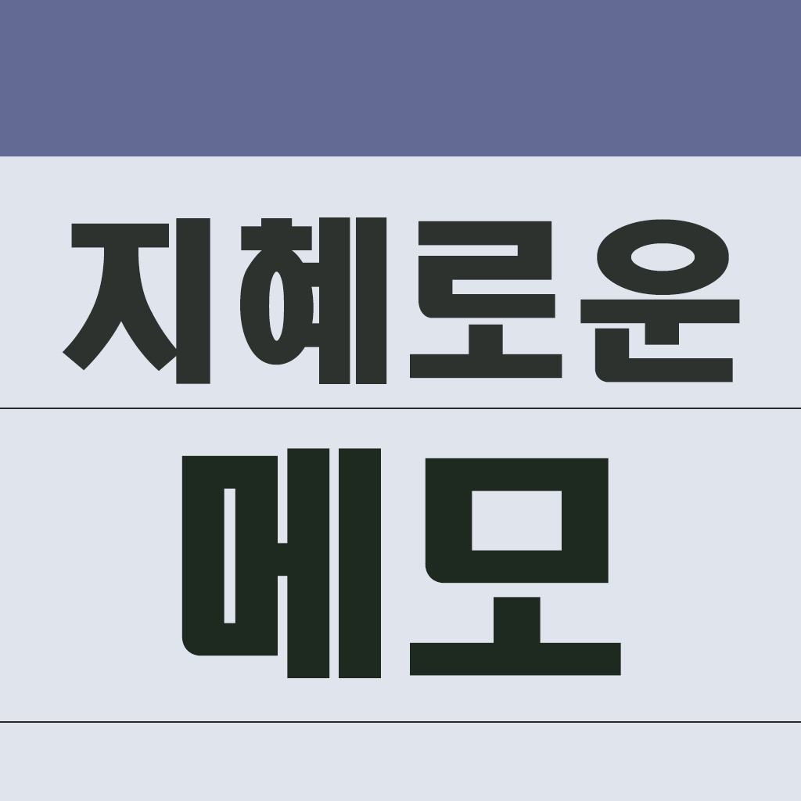
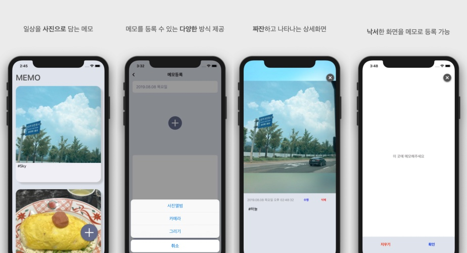
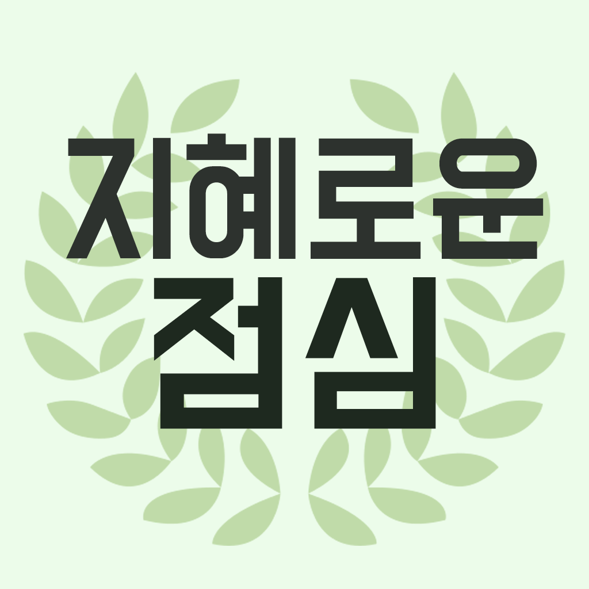
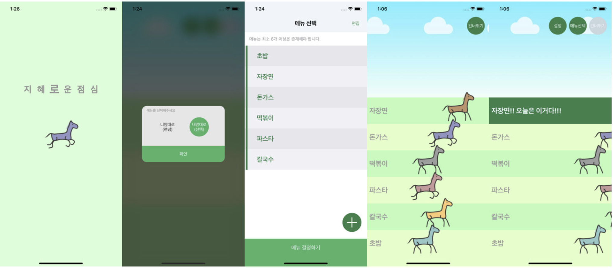

# Kwon Jihye 

- Mail  :  taerg89@gmail.com
- 블로그  :  https://blog.naver.com/taerg89
- Github  :  https://github.com/jeehge

 

## 경력

- 2018.10 ~ 현재   **실비모바일**   개발1팀    선임 연구원
- 2014.04 ~ 2018.09    **바루소프트**    Mobile Solution 주임 연구원

 

## 교육

- 2013.11 ~ 2014. 03 NFC 안드로이드 앱 개발자 양성과정 나이텍 -> AVA, Oracle, Spring Framework, Android, iBatis, NFC, Network 통신 등등

 

## 자격증

- **정보처리기사**  한국산업인력공단    2014.08
- **모바일앱개발전문가 1급**    한국정보통신진흥협회  2014.03

 

## 보유기술

- Language   
    Swift, Objective-C 

- Tool   
    TestFlight, fabric, Notion, Sourcetree, JIRA, Slack

- 형상관리   
    Git, SVN
    

 

## 활용 기술

- RESTful API
- json, xml parse
- AutoLayout, xib
- APNS, Local Notification
- Bluetooth
- NFC
- Custom Scheme
- WKWebView
- MQTT

  
 

## 활용 오픈소스

- Alamofire
- AFNetworking
- SwiftyJSON
- Firebase
- FMDB
- Crashlytics
- KingFisher
- SDWebImage
- Crashlytics
- SQLite

 

## **개인 프로젝트**

### **지혜로운 메모**
 >  일상을 기록하는 메모장

[다운로드](https://apps.apple.com/us/app/jhmemo/id1347454816?l=ko&ls=1&mt=8%29)

- 기간 : 2018.01 ~ 2018.02
- 사용언어 : Swift
- 담당업무 : 기획, 설계, 개발
- 기획의도 : 오늘 있었던 일을 **기록할 앱**을 만들고 싶어서 기획

#### 실행화면

#### 시행착오

1. 화면 구성에 대한 어려움 → 기획서 작성 및 다른 앱 설치
2. 예외처리 및 사용자 친화적이지 않은 UI/UX  → 주변 아이폰 사용자들의 피드백을 받음
3. 일정관리의 어려움 → 종료일을 정해두고 기능축소
4. 문제해결 능력 부족 → 경험치 상승을 위해 스터디 및 공부, 코드 리뷰를 받으면서 부족한 부분 피드백 받음
5. 코드 리펙토링 
    → viewdidload 에 주먹구구식 코드가 아닌 코드 기능별로 함수 사용 
    → 중복되는 코드 함수로 빼서 사용 
    → 앱 내 자주 쓰는 컬러는 확장하여 util 폴더에 정리 

#### 이 프로젝트를 통해

기획, 설계, 개발을 모두 하면서 서로의 이해관계에 대해서 이해할 수 있는 좋은 기회였습니다. 다양한 시행착오로 많은 경험을 얻을 수 있었으며, iOS 개발자로써 자부심과 자신감을 갖게 되었습니다.

 

### **지혜로운 점심**
 >  점심 메뉴를 쉽고 재미있게 선택할 수 있는 앱

[다운로드](https://apps.apple.com/us/app/지혜로운-점심/id1440288017)

- 기간 : 2018.07 ~ 2018.07
- 사용언어 : Swift
- 담당업무 : 기획, 설계, 개발
- 기획의도 : 점심 메뉴 고르기 어려워 하는 사람들을 위해 기획

#### 실행화면

#### 시행착오

1. 다양한 애니메이션 사용 → 다양한 애니메이션에 대해 공부(다른 앱에 들어간 애니메이션을 보고 따라 만들어 봄, Lets Build That App 영상 보고 따라 만들어 봄)
2. UITableView에 대한 이해 부족 → UITableViewDelegate에 있는 다양한 함수에 대한 활용 능력 상승 - selectindex 배열을 사용하지 않고 구현 
3. Local Notification 사용하기
4. 코드 리펙토링 
    → UITableView 관련 알고리즘 변경
    → FMDB 관련 DBManager 구조 변경
    → Storyboard 분리를 통해 화면 분리

#### 이 프로젝트를 통해

해커톤 형식으로 진행된 오프라인 모임에서 진행했던 프로젝트입니다. 그 날 완성하지 못한 것이 너무 아쉬워서 혼자 진행해서 완성 후 앱스토어 배포까지 했습니다. NSLayoutConstraint와 Animation, UI/UX에 대해서 많이 배웠습니다. 이 프로젝트를 하면서 추가 기능도 고민하고 꾸준히 앱을 관리하는 습관을 가지게 된 것 같습니다.

