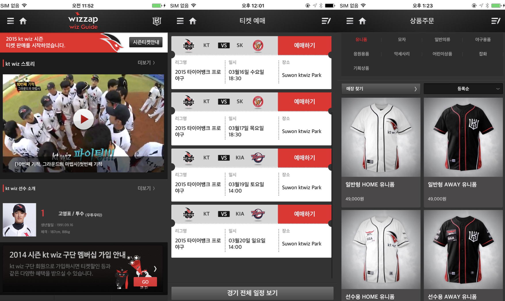
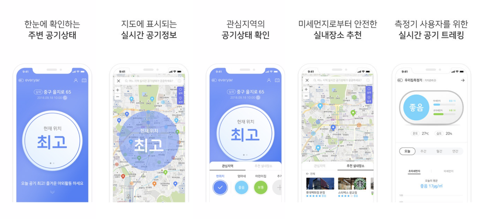

# Kwon Jihye 

<!---->

- Mail  :  taerg89@gmail.com
- 블로그  :  https://blog.naver.com/taerg89
- Github  :  https://github.com/jeehge

 

## SKILLS

- Language   
    Swift, Objective-C, SwiftUI

- Tool   
    TestFlight, Notion, Sourcetree, JIRA, Slack, JANDI, Wiki 

- 형상관리   
    Git, SVN
    

 

## Open Source

- RxSwift
- Alamofire/AFNetworking
- Firebase
- FMDB
- Kingfisher
- ChannelIO
- SnapKit
- Then
- SwiftLint

 

## 활용 기술

- RESTful API
- json, xml parse
- AutoLayout, xib
- APNS, Local Notification
- Bluetooth, BLE
- NFC
- WebKit

 

## **개인 프로젝트**

### **지혜로운 메모**
 >  일상을 기록하는 메모장

[다운로드](https://apps.apple.com/us/app/jhmemo/id1347454816?l=ko&ls=1&mt=8%29)

- 기간 : 2018.01 ~ 2018.02
- 사용언어 : Swift
- 담당업무 : 기획, 설계, 개발
- 기획의도 : 오늘 있었던 일을 **기록할 앱**을 만들고 싶어서 기획

#### 실행화면

#### 시행착오

1. 화면 구성에 대한 어려움 → 기획서 작성 및 다른 앱 설치
2. 예외처리 및 사용자 친화적이지 않은 UI/UX  → 주변 아이폰 사용자들의 피드백을 받음
3. 일정관리의 어려움 → 종료일을 정해두고 기능축소
4. 문제해결 능력 부족 → 경험치 상승을 위해 스터디 및 공부, 코드 리뷰를 받으면서 부족한 부분 피드백 받음
5. 코드 리펙토링 
    → viewdidload 에 주먹구구식 코드가 아닌 코드 기능별로 함수 사용 
    → 중복되는 코드 함수로 빼서 사용 
    → 앱 내 자주 쓰는 컬러는 확장하여 util 폴더에 정리 

 

### **지혜로운 점심**
 >  점심 메뉴를 쉽고 재미있게 선택할 수 있는 앱

[다운로드](https://apps.apple.com/us/app/지혜로운-점심/id1440288017)

- 기간 : 2018.07 ~ 2018.07
- 사용언어 : Swift
- 담당업무 : 기획, 설계, 개발
- 기획의도 : 점심 메뉴 고르기 어려워 하는 사람들을 위해 기획

#### 실행화면

#### 시행착오

1. 다양한 애니메이션 사용 → 다양한 애니메이션에 대해 공부(다른 앱에 들어간 애니메이션을 보고 따라 만들어 봄, Lets Build That App 영상 보고 따라 만들어 봄)
2. UITableView에 대한 이해 부족 → UITableViewDelegate에 있는 다양한 함수에 대한 활용 능력 상승 - selectindex 배열을 사용하지 않고 구현 
3. Local Notification 사용하기
4. 코드 리펙토링 
    → UITableView 관련 알고리즘 변경
    → FMDB 관련 DBManager 구조 변경
    → Storyboard 분리를 통해 화면 분리

 

## **회사 프로젝트**

### **Wizzap**

kt wiz 야구단 공식 어플리케이션

- 기간 : 2016.06 ~ 2018.09

- 사용언어 : Objective-C

- 담당업무 : 유지보수

    → wizzap 2.0 서비스 및 고도화

    → iPhone X 대응 및 Frame 으로 작업된 화면 오토레이아웃으로 변경하는 작업
    
    
- 앱스토어 주소 : https://itunes.apple.com/kr/app/wizzap/id975125575?mt=8

#### 실행화면

#### 시행착오

iOS를 담당하게 되면서 처음 맡은 프로젝트입니다. UI 관련해서 가장 많이 배웠고, 많은 회의에 참석하며 서버 팀과 협업 및 문제 해결 능력을 상승시켰습니다.

 

### **every air**

미세먼지로부터 내 몸과 가족을 보호하는 스마트한 방법, 에브리에어

- 기간 : 2017.12 ~ 2018.04

- 사용언어 : Objective-C

- 담당업무 : 설계, 개발

    → 하이브리드앱

    → 블루투스 장비와 연결 및 정보를 주고 받는 작업
    
    
- 앱스토어 주소 : https://apps.apple.com/kr/app/에브리에어/id1436573324

#### 실행화면

#### 시행착오

처음 메인으로 담당했던 프로젝트입니다. 기존에 사용할 기회가 없었던 WKWevKit, BLE에 대해서 알 수 있는 좋은 기회였습니다. 설계 과정부터 모든 협의에 참여했으며 iOS 개발자로써 한 단계 성장할 수 있었습니다. 

 

## 교육

- 2013.11 ~ 2014. 03 NFC 안드로이드 앱 개발자 양성과정 나이텍 -> AVA, Oracle, Spring Framework, Android, iBatis, NFC, Network 통신 등등

 

## 자격증

- **정보처리기사**  한국산업인력공단    2014.08
- **모바일앱개발전문가 1급**    한국정보통신진흥협회  2014.03
